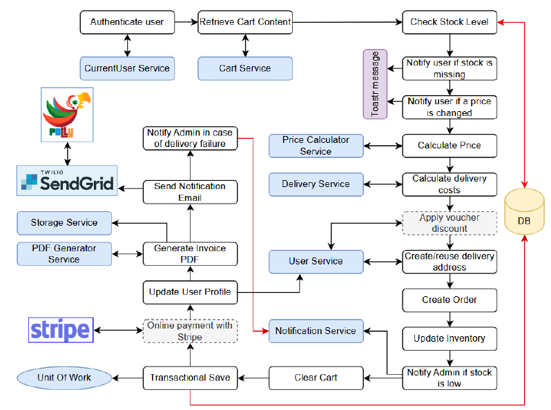
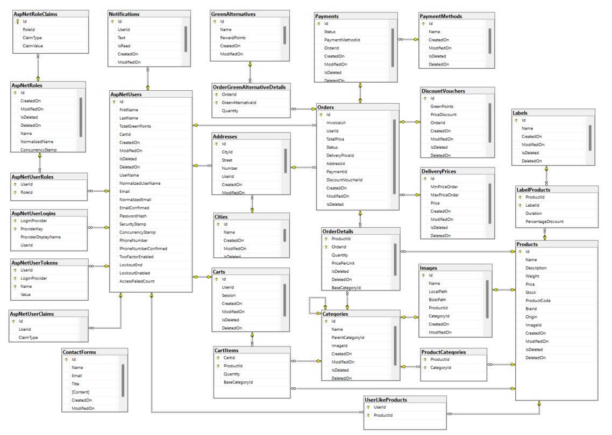

## 🛒 ReGreenShop – Eco Grocery Store

🔗 📽️ This is the [link](screenshots/Presentation.pdf) to the presentation I made during the graduation at the Amdaris internship

ReGreenShop is a full-stack ASP.NET Core 8.0 web application developed as part of an internship project. It simulates a modern online grocery store — similar to eBag and Kolichka — with an eco-conscious twist. Users not only shop for groceries but also participate in a built-in recycling program that rewards them with discount points.

---

## 📝 Project Description

ReGreenShop is designed for users in urban areas like Sofia, where recycling options are limited. It integrates common e-commerce features with an innovative bottle-return system:

- Return plastic and glass containers during delivery.
- Earn **ReGreenPoints** for each item returned.
- Exchange points for **discount vouchers**.
- All recycling rules are explained in a dedicated **ReGreenRules** section.

The application emphasizes **scalability**, **clean architecture**, and **production-readiness**.

---

## 👤 Roles & Authentication

There are two main roles:

### 🔐 User
- Browse and search ~2,000 products from 240 categories.
- Add items to cart (even without login).
- Place and track orders.
- Like products, view purchase history.
- Redeem discount vouchers and ReGreenPoints.
- Google OAuth login available.

### 🛠️ Admin
- Has all user capabilities plus:
  - Finalize orders and confirm returned recyclables.
  - Manage products (CRUD with pagination and filters).
  - Receive real-time alerts for low stock or background task errors.
  - Use **real-time chat** with users via SignalR.
  - View and respond to all chats.
  - Monitor failed background jobs (e.g., failed emails).

---

## 🛠️ Technology Stack

### Backend

- **ASP.NET Core 8.0**, **Entity Framework Core**
- **SQL Server**
- **Clean Architecture** with:
  - CQRS using **MediatR**
  - Validation via **FluentValidation**
  - Logging via **Serilog**
  - Mapping via **AutoMapper**
  - Background jobs via **HangFire**
  - PDF generation with **QuestPDF**
  - Email via **SendGrid** (with **Polly** retry policies)
  - Real-time communication with **SignalR**
  - JWT-based authentication
  - **Google Login (OAuth 2.0)**
  - Soft deletes & GDPR compliance
  - Global exception handling middleware

### Frontend

- **React + TypeScript**
- **React Bootstrap** for responsive design
- **SignalR Client** for real-time admin-user chat
- **Playwright** for scraping data from kolichka.bg
- **Swagger** for API testing
- Search with fuzzy-matching logic (Elasticsearch planned)

### DevOps

- **Microsoft Azure** deployment:
- Debugging via **Azure Kudu**
- WebSocket setup for SignalR
- QR code for easy app access

---

## 📦 E-Commerce Features
Make an order flow diagram

- Real-time stock validation before checkout.
- Complex order flow using multiple services:
- Smart cart merging (session to user)
- Stripe for secure online payments
- Scheduled Hangfire jobs:
  - Clean abandoned carts
  - Update weekly promotions
- Discounts: 2-for-1 deals, percentage promos
- Real-time admin notifications on stock or system events

---

## 🔍 Architecture Highlights

- **Clean Architecture** with 4 core layers
- Dependency Injection via Startup Project
- Reflection-based service and AutoMapper profile registration
- Custom model binders for price formats (dot/comma)
- Soft delete via global EF filter
- CQRS for optimized read/write separation
- Logging of long-running queries (>5s) via Serilog

---

## 🧪 Testing & Quality

- Backend code quality enforced with **StyleCop**
- Frontend formatting standardized using **Prettier**
- Error handling includes user-friendly messages and admin alerts

---

## 🔮 Future Plans

- 🔍 **ElasticSearch** for advanced product search and filtering
- 📦 **Smart delivery coordination system** with optimized courier routing
- 📈 **Admin dashboards** for real-time analytics and metrics
- 🧼 Refactoring React components into smaller, reusable units

---

## 🔗 Live Demo

If you’d like to see and browse the app in action, visit the link below:

🌐 [Live Demo on Azure](https://regreenshop-bjd6fje3ekfmgxbf.westeurope-01.azurewebsites.net/)

> If the link is unavailable, it’s likely because my free Azure student credits have expired. Hosting ASP.NET Core applications with SQL Server requires resources that are not fully supported by most free platforms. If the link doesn’t work, feel free to check the repository and run the app locally using the setup guide below.

---

## 🚀 Local Setup Guide

1. **Clone the Repository**
2. **Backend Requirements**
   - .NET 8 SDK
   - SQL Server
3. **Frontend Setup**
   - Node.js (for React dependencies)
   - Run `npm install` in the frontend directory
4. **Environment Variables / Configuration**
   - `appsettings.json`: DB connection, SendGrid, Stripe, Google APIs
5. **Database**
   - EF Core migrations applied automatically

## 🗃️ Database Overview

- Clean relational model with indexed soft deletes
- Sensitive data nulled out for GDPR compliance
- Single shopping cart per user/session
- Full invoice history with downloadable PDFs

---

## 🧩 Notable Features

- Session-based cart merging with user cart on login
- Custom promotions engine via recurring weekly **Hangfire** job
- Stripe fallback logic (order saved as "Unpaid" if payment fails)
- User notification system for orders and recycling points
- Real-time chat auto-disconnect logic 

---

